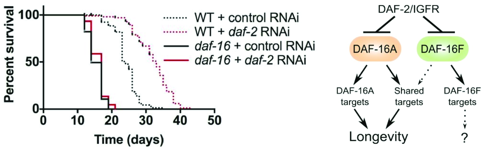

<!-- TOC START min:1 max:2 link:true asterisk:false update:true -->
- [Day 1: Introduction](#day-1-introduction)
    - [Research in aging](#research-in-aging)
    - [Aging and the worm](#aging-and-the-worm)
    - [The question](#the-question)
    - [The approach](#the-approach)
    - [About this vignette](#about-this-vignette)
- [Day 2: Proteomics](#day-2-proteomics)
    - [Set up environment](#set-up-environment)
    - [Load and inspect the data](#load-and-inspect-the-data)
    - [Adding gene information](#adding-gene-information)
    - [Separating into lists of tissue-specific proteins](#separating-into-lists-of-tissue-specific-proteins)
    - [Compare it to existing tissue-specific datasets from RNA-seq](#compare-it-to-existing-tissue-specific-datasets-from-rna-seq)
    - [Save your work!!](#save-your-work)
- [Day 3: ATAC-seq](#day-3-atac-seq)
    - [Set up environment](#set-up-environment-1)
    - [Load previous work](#load-previous-work)
    - [Get the ATAC-seq aging data](#get-the-atac-seq-aging-data)
    - [Investigate the genes associated to varying promoters during aging](#investigate-the-genes-associated-to-varying-promoters-during-aging)
    - [Save your work!!](#save-your-work-1)
- [Day 4: ChIP-seq](#day-4-chip-seq)
    - [Set up environment](#set-up-environment-2)
    - [Load previous work](#load-previous-work-1)
    - [Get the ChIP-seq data](#get-the-chip-seq-data)
    - [Investigate the TFs associated to varying promoters during aging](#investigate-the-tfs-associated-to-varying-promoters-during-aging)
    - [Defining key TFs involved in aging?](#defining-key-tfs-involved-in-aging)
    - [Save your work!!](#save-your-work-2)
- [SessionInfo](#sessioninfo)
- [References](#references)
<!-- TOC END -->

# Day 1: Introduction

## Research in aging

Aging is a time-dependent functional decline that affects most living organisms. It is characterized by a progressive loss of physiological integrity, leading to impaired function and increased vulnerability to death.

The accumulation of cellular damage is widely considered to be the general cause of aging [@Lopez-Otnn2013Jun], which explains why the studies from the last three decades have mostly focused on the *cellular* aspects of aging.  
Currently, the aging hallmarks are:  

- Genomic instability;
- Telomere attrition;
- Epigenetic alterations; 
- Loss of proteostasis;
- Deregulated nutrient sensing;
- Mitochondrial dysfunction;
- Cellular senescence;
- Stem cell exhaustion;
- Altered intercellular communication.


However, aging should not only be seen as a *cellular disfunction* but as an *organismal* process. All the cells within an organism are undergoing aging, and not all of them are aging simultaneously. Overall, different tissues are aging differently [@Son2019Apr]. Thus, aging is a decline affecting not only cellular components but also organismal biological processes in general. 


## Aging and the worm 

Aging research was inaugurated more than 30 years ago, following the isolation of the first long-lived strains in C. elegans [@Johnson2013Jul]. In the past three decades, the nematode played a fundamental role in aging research. It is a powerful model organism when it comes to studying aging:  

- It has a short life cycle (~ 21 days in normal conditions);
- Mutants can be easily generated and phenotypically screened for aging defects;
- Longevity assays are easy to perform and very informative;
- Its genome has been fully sequenced and presents fundamental resemblances with that of more complex metazoans. 

One of the most used phenotypic assays in worm is the longevity assay. Longevity assays are useful to understand whether a gene is involved in aging [@Chen2015Oct]. RNAi is used to knock-down a gene of interest and the resulting longevity is measured. If the longevity increases, the gene function normally reduce it.  
In worms, RNAi can be used in large-scale screens. RNAi screens have been performed and have led to the identification of tens of genes involved in aging and regulation of longevity in general. It has been instrumental to decipher the molecular pathways involved in aging [@Hamilton2005Jan].  



## The question

If RNAi has been instrumental to generally study the process of aging in worm, the readouts are generally phenotypic readouts, *e.g.* does the worm live longer? Or does it rapidly stop moving after knock-down? These readouts are poorly suited to understand the aging-related role of a protein coded by a given gene in specific tissues. For instance, *slo-1* is a gene coding for a potassium channel. Its mutation or knock-down accelerates aging [@Chen2013Dec]. Because we have some information about the nature and function of the coded protein, it is rather easy to speculate in each tissue it has an aging-related function (hint: the neurons!).  
However, if we do not know anything about the gene (*e.g.* in which tissue it is expressed, which transcription factors regulate its expression, the type of protein encoded by it, ...), it becomes challenging to draw conclusions on the molecular mechanisms involving the protein encoded by the gene.  
Rather than relying on RNAi screens, one could leverage the large amount of "omics" data generated in C. elegans to better characterize aging processes at the organismal level. The goal of this study is to analyze aging-related perturbations in worm in a **comprehensive** manner to (1) identify the tissues undergoing important remodeling during aging and (2) understand the molecular networks involved in aging. More specifically, we would like to fulfill the following aims:  

1. Find tissue-specific proteins and genes deregulated during aging;
2. Find their associations with known diseases;
3. Find potential targets for drug engineering

## The approach 

RNAi has been extensively used to study aging in worm. However, next-generation techniques such as high-throughput sequencing or mass spectrometry now allow for more comprehensive multiomics studies of biological processes. We will rely on results from these techniques to: 

1. Day 2: Annotate sets of tissue-specific proteins (using proteomics results) and compare it with sets of tissue-specific genes (using transcriptomics results);
3. Day 3: Find genomic regions regulating these genes (using epigenomics results);
4. Day 4: Identify networks of transcription factors regulating these genes (using epigenomics results).

## About this vignette

Over the next three days, we will be conducting analysis of several types of datasets in R. This vignette is to be used as a guideline and lists important questions or technical aspects. The R code is only here to suggest one solution to the question(s) raised. Before looking at it, it is recommended to investigate the data by yourself and try out your own commands.

---  

# Day 2: Proteomics

Today we will be focusing on analyzing the proteomics data generated in @Reinke2017-jc: "In vivo mapping of tissue- and subcellular-specific proteomes in Caenorhabditis elegans".
Reading the abstract of the paper is recommended to understand what the authors have attempted to do. In short, the authors have used a protein proximity labelling technique to label cytoplasmic or nuclear proteins in four different tissues of the worm: intestine, epidermis, body wall muscle and pharyngeal muscle. Proteins enriched in each subcellular location or tissue were then identified by mass spectrometry. 

## Set up environment
You will first need to make sure that you are working in the right folder. You can also load important packages at this point.

```{r collapse = TRUE}
    PROJECT_PATH <- getwd()
    require(tidyverse)
    require(rtracklayer)
    require(biomaRt)
```

## Load and inspect the data
The data has been fetched from [the original paper](https://advances.sciencemag.org/highwire/filestream/195514/field_highwire_adjunct_files/1/1602426_TableS4.xlsx) and reformatted for the purpose of the course. Start by loading it from data/1602426_TableS4.csv. 

### Questions: 
- How many proteins are studied?
- How many are in each tissue? 

```{r collapse = TRUE, eval = TRUE}
    proteomics <- read.csv(
        file.path(PROJECT_PATH, '../data/1602426_TableS4_processed.csv'), 
        na.strings = "NA"
    )
    # Number of proteins in the file
    nrow(proteomics)
    # Number of proteins detected in each tissue
    colSums(proteomics[,38:45])
```

## Adding gene information
This file only contains the protein names. Eventually, we will be 
looking at genes as well. The simplest approach is to convert everything
to unique gene IDs. 
For this, we will rely on BiomaRt.

### Questions: 
- What is the difference between Swissprot and Trembl? 
- Why is there less annotations from SwissProt?
- Why does the original dataset contain both types of IDs?
- Why are there some protein IDs that do not match any gene ID? 
- Are there proteins coming from the same gene? 

```{r collapse = TRUE, eval = TRUE}
    # You can get IDs of genes and associated proteins using biomaRt
    ### ensembl <- useDataset("celegans_gene_ensembl", mart = useMart("ensembl"))
    ### ids <- getBM(
    #     attributes = c("uniprotswissprot", "uniprotsptrembl", "wormbase_gene"),
    #     mart = ensembl
    # )
    # Otherwise, you can also get the ids table from the data folder: 
    ids <- read.table('../data/proteins_genes_IDs.txt', header = TRUE, sep = '\t')
    # Merging SwissProt and Trembl IDs into one column will make your life easier
    ids$protID <- paste0(ids$uniprotswissprot, ids$uniprotsptrembl)
    # Then a simple match function can be used to translate the protein IDs into gene IDs
    proteomics$WormBaseID <- ids$wormbase_gene[match(proteomics$UniProtKB, ids$protID)]
    # Few proteins do not have any gene ID (why?). We will ignore these ones for the rest of the study.
    proteomics <- proteomics[!is.na(proteomics$WormBaseID),]
```

## Separating into lists of tissue-specific proteins
Let's figure out which proteins are specifically present in each tissue.

### Questions: 
- How many proteins are present specifically in one tissue?
- For each set of proteins, are they more cytoplasmic or nuclear-enriched? 
- Which ones are transcription factors? (Hint: there is a list of all transcription factors annotated in C. elegans in the data folder...)
- Can you say anything about the tissue-specific TFs? 
- What do you think about this? Are transcription factors enriched in the sets of tissue-specific proteins?

```{r collapse = TRUE, eval = TRUE}
    # Let's retrieve the list of proteins specifically enriched in a single tissue
    list_prots <- lapply(
        levels(proteomics$Tissue.specific), 
        function(TISSUE) {
            proteomics$UniProtKB %>%
                '['(proteomics$Tissue.specific == TISSUE & !is.na(proteomics$Tissue.specific)) %>% 
                as.character()
        }
    ) %>% setNames(levels(proteomics$Tissue.specific))
    lengths(list_prots)
    # Because we will need it later, you can also get the same list but with gene IDs
    list_genes <- lapply(
        levels(proteomics$Tissue.specific), 
        function(TISSUE) {
            proteomics$WormBaseID %>%
                '['(proteomics$Tissue.specific == TISSUE & !is.na(proteomics$Tissue.specific)) %>% 
                as.character()
        }
    ) %>% setNames(levels(proteomics$Tissue.specific))
    # A list of most of the transcription factors found in C. elegans genome can be found in data/TFs.txt
    tfs <- readLines('../data/TFs.txt')
    length(tfs)
    # Let's see which proteins enriched in tissues are transcription factors
    tfs_in_tissue_specific_prots <- lapply(list_prots, function(prots) {
        prots[proteomics$WormBaseID[match(prots, proteomics$UniProtKB)] %in% tfs]
    })
    # Let's see if transcription factors are enriched 
    n_prots <- nrow(ids)
    n_tfs <- length(tfs)
    n_tissue_spe_prots <- sum(lengths(list_prots))
    n_tfs_in_tissue_specific_prots <- sum(lengths(tfs_in_tissue_specific_prots))
    contingency_matrix <- matrix(
        cbind(
            c(n_tfs_in_tissue_specific_prots, n_tfs - n_tfs_in_tissue_specific_prots), 
            c(n_tissue_spe_prots - n_tfs_in_tissue_specific_prots, n_prots - n_tfs - n_tissue_spe_prots + n_tfs_in_tissue_specific_prots)
        ), 
        nrow = 2
    )
    fisher.test(contingency_matrix)
```

## Compare it to existing tissue-specific datasets from RNA-seq
Let's see if this set of proteins overlap with tissue-specific gene annotation. For this, we can use the data in data/gene_annotations.gff3. This is a .gff3 file, a format used to add specific information to gene annotations. This annotation file has not been published yet. 

### Questions: 
- Explain the fundamental differences between the 2 sets of data?
- Are the experiments from the same developmental stage?
- Are the two datasets consistent with to each other?
- What are some good ways to represent the intersection between these datasets?
- Can you comment on the list of proteins specifically present in pharyngeal muscles, when compared to the gene annotations from transcriptomics?

```{r collapse = TRUE, eval = TRUE}
    # Let's import the gene annotation information
    genes <- import('../data/gene_annotations.gff3')
    names(genes) <- genes$ID
    # It will be easier if we convert the tissue-specific gene annotation to a vector
    genes$which.tissues <- factor(genes$which.tissues, levels = c(
        'Germline', 'Sperm', 'EarlyGermline', 'Neurons', 'Muscle', 'Hypod.', 'Intest.', 
        'Germline_Neurons', 'Germline_Muscle', 'Germline_Hypod.', 'Germline_Intest.', 'Neurons_Muscle', 'Neurons_Hypod.', 'Neurons_Intest.', 'Muscle_Hypod.', 'Muscle_Intest.', 'Hypod._Intest.',
        'Germline_Neurons_Muscle', 'Germline_Neurons_Hypod.', 'Germline_Neurons_Intest.', 'Germline_Muscle_Hypod.', 'Germline_Muscle_Intest.', 'Germline_Hypod._Intest.', 'Neurons_Muscle_Hypod.', 'Neurons_Muscle_Intest.', 'Neurons_Hypod._Intest.', 'Muscle_Hypod._Intest.', 
        'Germline_Neurons_Muscle_Hypod.', 'Germline_Neurons_Muscle_Intest.', 'Germline_Neurons_Hypod._Intest.', 'Germline_Muscle_Hypod._Intest.', 'Neurons_Muscle_Hypod._Intest.', 
        'Germline_Neurons_Muscle_Hypod._Intest.', 
        'Soma', 'Ubiq.', 'Ubiq.-Reg', 'Unclassified', 'Low', 'non-prot-cod'
    ))
    # We can compare the two different tissue-specific annotations
    lapply(list_genes, function(g) {
        table(genes[g]$which.tissues)
    })
    # We can also plot something
    df <- data.frame(
        transcriptome_annotations = genes[unlist(list_genes)]$which.tissues, 
        proteomics_annotations = proteomics[match(unlist(list_genes), proteomics$WormBaseID),]$Tissue.specific
    ) %>% 
        table() %>% 
        as.data.frame() 
    p <- ggplot(df, aes(y = 1, x = transcriptome_annotations)) +
        geom_tile(aes(fill = Freq)) + 
        geom_text(aes(label = Freq)) +
        scale_fill_gradientn(colours = c('white', 'orange', 'red')) + 
        theme_bw() + 
        facet_wrap(~proteomics_annotations) + 
        labs(y = '', x = 'Transcriptomics-based annotations') + 
        theme(axis.text.y = element_blank(), axis.ticks.y = element_blank(), axis.title.y = element_blank()) + 
        theme(axis.text.x = element_text(angle = 45, hjust = 1, vjust = 1))
    p
```

## Save your work!!
That's it for today! Don't forget to save your progress.

```{r collapse = TRUE, eval = TRUE}
    save.image('../results/Day2.RData')
```

--- 

# Day 3: ATAC-seq

Today you will be focusing on investigating the ATAC-seq data generated in @Janes2018Oct: "Chromatin accessibility dynamics across C. elegans development and ageing".

## Set up environment
Once again, first make sure that you are working in the right folder. You can also load important packages at this point.

```{r collapse = TRUE, eval = TRUE}
    PROJECT_PATH <- getwd()
    require(tidyverse)
    require(rtracklayer)
    require(htmlwidgets)
    require(gprofiler2)
    require(DOSE)
    require(clusterProfiler)
    require(org.Hs.eg.db)
```

## Load previous work
The work done in Day 2 has been stored in an RData object.

```{r collapse = TRUE, eval = TRUE}
    load('../results/Day2.RData')
```

## Get the ATAC-seq aging data
The data has been fetched from [the original paper](https://elifesciences.org/articles/37344) and reformatted for the purpose of the course. Start by loading it from data/ATAC_aging.gff3 

### Questions: 
- Which format is the ATAC_aging.gff3 file? What does the file contain?
- Look at the cluster information: can you visualize variations of promoter accessibility during aging?
- Use the Seqplots software to get more insights about the clusters
- In which tissue(s) are the associated genes transcribed & translated?

```{r collapse = TRUE, eval = TRUE}
    REs <- import('../data/ATAC-seq_aging.gff3')
    REs <- REs[REs$ageing_prom_cluster_label != '.']
    ATAC_aging <- mcols(REs)[, 8:12] %>% 
        data.frame() %>% 
        data.matrix() %>% 
        as.data.frame() 
    # Visualization in R
    df <- data.frame(
        locus = REs$locus,
        apply(ATAC_aging, 1, function(ROW) {log2(ROW/mean(ROW))}) %>% t() %>% data.frame(),
        cluster = REs$ageing_prom_cluster_label
    ) %>% 
        gather(stage, expr, -cluster, -locus) %>%
        mutate(stage = factor(stage, levels = c('FPM_ATAC_aYA', 'FPM_ATAC_aD3', 'FPM_ATAC_aD7', 'FPM_ATAC_aD10', 'FPM_ATAC_aD14'))) %>%
        filter(cluster != '.')
    p <- ggplot(df, aes(x = stage, y = expr, color = cluster, group = locus)) + 
        geom_line(alpha = 0.05) + 
        theme_bw() + 
        facet_wrap(~cluster) +
        theme(axis.text.y = element_blank(), axis.ticks.y = element_blank(), axis.title.y = element_blank()) + 
        theme(axis.text.x = element_text(angle = 45, hjust = 1, vjust = 1)) + 
        theme(legend.position = 'none')
    p
    # Export bed files of promoters from each cluster and visualize the accessibility profiles over each set using SeqPlots
    for (cluster in levels(df$cluster)) {
        export(granges(REs[REs$ageing_prom_cluster_label == cluster]), paste0('ATAC_cluster-', cluster, '.bed'))
    }
    # Check the association between REs and proteins
    list_genes_aging <- lapply(levels(df$cluster), function(cluster) {
        proms <- REs[REs$ageing_prom_cluster_label == cluster & REs$regulatory_class %in% c('bidirect-promoter', 'fwd-promoter', 'rev-promoter')]
        genes_cluster <- proms$WormBaseID %>% as.character() %>% strsplit(',') %>% unlist()
        return(genes_cluster)
    }) %>% setNames(levels(df$cluster))
    # We can also plot something
    df <- data.frame(
        cluster_annotations = unlist(lapply(seq_along(list_genes_aging), function(K) {rep(names(list_genes_aging)[K], length(list_genes_aging[[K]]))})),
        proteomics_annotations = proteomics[match(unlist(list_genes_aging), proteomics$WormBaseID),]$Tissue.specific
    ) %>% 
        table() %>% 
        as.data.frame() %>% 
        filter(cluster_annotations != 'stable')
    p <- ggplot(df, aes(y = 1, x = cluster_annotations)) +
        geom_tile(aes(fill = Freq)) + 
        geom_text(aes(label = Freq)) +
        scale_fill_gradientn(colours = c('white', 'orange', 'red')) + 
        theme_bw() + 
        facet_wrap(~proteomics_annotations) + 
        labs(y = '', x = 'Ageing cluster') + 
        theme(axis.text.y = element_blank(), axis.ticks.y = element_blank(), axis.title.y = element_blank()) + 
        theme(axis.text.x = element_text(angle = 45, hjust = 1, vjust = 1))
    p
```

## Investigate the genes associated to varying promoters during aging

### Questions: 
- What is the function of genes going up (down) during aging?
- What are their counterpart in mammals?
- What are the diseases associated to these genes?
- Comment on the rationale of the analysis: we are looking at genes associated to promoters de-regulated during aging... 

```{r collapse = TRUE, eval = FALSE}
    # GO enrichment analysis 
    genes_down <- unique(unlist(list_genes_aging[2:5]))
    genes_up <- unique(unlist(list_genes_aging[6:9]))
    gos <- gost(
        list(
            up = genes_up, 
            down = genes_down
        ),
        organism = 'celegans', 
        multi_query = TRUE, 
        user_threshold = 0.01, 
        source = c('GO:BP', 'GO:MF', 'GO:CC')
    )
    p <- gostplot(gos, capped = TRUE, interactive = TRUE)
    saveWidget(p, 'GOs.html')
    # Homo sapiens homologs
    ensembl <- useDataset("celegans_gene_ensembl", mart = useMart("ensembl"))
    human_homologues_down <- getBM(
        filters = c("ensembl_gene_id"),
        values = genes_down, 
        attributes = c('ensembl_gene_id', 'hsapiens_homolog_ensembl_gene'),
        mart = ensembl
    )
    human_homologues_up <- getBM(
        filters = c("ensembl_gene_id"),
        values = genes_up, 
        attributes = c('ensembl_gene_id', 'hsapiens_homolog_ensembl_gene'),
        mart = ensembl
    )
    # DOSE
    human_homologues_down_ENTREZ <- bitr(
        human_homologues_down$hsapiens_homolog_ensembl_gene %>% '['(nchar(.) > 0), 
        fromType = "ENSEMBL", 
        toType = c("ENTREZID"), 
        OrgDb = org.Hs.eg.db
    )$ENTREZID
    diseases_enrichment_down <- enrichDO(
        gene = human_homologues_down_ENTREZ, 
        ont = "DO", 
        pvalueCutoff = 0.01,
        pAdjustMethod = "BH",
        readable = TRUE
    )
```

## Save your work!!
Don't forget to save your progress!

```{r collapse = TRUE, eval = FALSE}
    save.image('../results/Day3.RData')
```

---  

# Day 4: ChIP-seq

Today you will be focusing on investigating ChIP-seq data generated by the modENCODE consortium, to understand which TFs are regulating the promoters which are varying during aging

## Set up environment
Once again, you need to make sure that you are working in the right folder. Important packages will also be loaded at this point.

```{r collapse = TRUE, eval = FALSE}
    PROJECT_PATH <- getwd()
    require(tidyverse)
    require(rtracklayer)
    require(biomaRt)
```

## Load previous work
The work done in Day 2 and Day 3 has been stored in an RData object.

```{r collapse = TRUE, eval = FALSE}
    load('../results/Day3.RData')
```

## Get the ChIP-seq data

### Questions: 
- What is modENCODE? 
- How to download all the data from modENCODE? 
- What useful format can be used here to easily get information on TF binding profiles? Is .bed format better than .bw format for our purpose? Why?

## Investigate the TFs associated to varying promoters during aging

### Questions: 
- How to summarize all the modENCODE data?
- Which metric should be calculated to see if a TF is enriched in a set of promoters? 
- How can you represent the importance of all TFs in each cluster? 
- Can you define binding motifs for the TFs enriched in some clusters? 

## Defining key TFs involved in aging? 

### Questions: 
- Is there a group of motifs functionally interacting? 
- What can you find in the literature about these factors?

## Save your work!!
Don't forget to save your progress!

```{r collapse = TRUE, eval = FALSE}
    save.image('../results/Day4.RData')
```

---

# SessionInfo 
```{r echo=FALSE, collapse = TRUE, eval = TRUE}
    sessionInfo()
```

# References